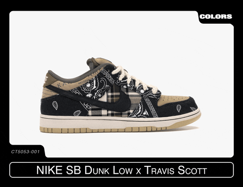

<div style="text-align: center;">
<h1>Analiza rynku sneakersów Nike</h1>
<p>Autor: Oleh Zemlianyi</p>
</div>

```{r setup, include=FALSE}
options(warn=-1)
knitr::opts_chunk$set(echo = FALSE,message = FALSE,warning = FALSE)
```

```{r}
data <- read.csv("Nike_shoes_2023-04-16.csv")
dane <- data[, c("title", "sub_title", "brand", "color_breif", "fullPrice", "currentPrice", "discount_amount")]
#dane
```

<h3>
Cel Ogólny: 
</h3>

* <span style="font-size: 150%;"> Przeprowadzenie kompleksowej analizy rynku sneakersów marki Nike z wykorzystaniem danych liczbowych i wizualizacji. </span>

<h3>
Cele Szczegółowe:
</h3>

* <span style="font-size: 150%;">Zbadanie zróżnicowania cenowego w poszczególnych kategoriach butów sportowych.</span>
* <span style="font-size: 150%;">Przedstawienie zależności między rodzajem butów a ich ceną.</span>
* <span style="font-size: 150%;">Porównanie cen najdroższej i najtańszej pary butów, z uwzględnieniem różnic wynikających z różnych czynników, takich jak marka, design. </span>
* <span style="font-size: 150%;">Analiza rozkładu gęstości cen dla trzech najpopularniejszych rodzajów obuwia, w celu zrozumienia, gdzie najczęściej skupiają się ceny w poszczególnych kategoriach.</span>
* <span style="font-size: 150%;">Graficzne przedstawienie średnich cen różnych typów butów, ukazując zróżnicowanie cen jako ważny czynnik wpływający na wybór klientów.</span>


<h2 style="text-align:center;">

Moda i Indywidualizm w Dzisiejszym Świecie

</h2>

### W dzisiejszym świecie **buty sportowe** przestały być jedynie elementem garderoby. Stały się nie tylko przedmiotem użytkowym, ale i symbolem **stylu**, **kultury** i nawet **sztuki**. To, co kiedyś było postrzegane jako funkcjonalny element garderoby, dzisiaj stało się manifestem **indywidualności** i twórczego wyrazu.

### Mój projekt to podróż przez świat **butów sportowych** poprzez pryzmat danych. Moje zainteresowanie nie ogranicza się jedynie do analizy i faktów. Badając tabele i liczby, staram się ukazać ten wewnętrzny świat, gdzie każda para **butów** staje się unikalnym dziełem **sztuki**. W tym projekcie pokażę i opowiem o bardziej szczegółowych aspektach tej światowej branży.


<h2 style="text-align:center;">

Średnie ceny w poszczególnych kategoriach

</h2>

### Ten rozdział przedstawia **analizę średnich cen** w zróżnicowanych kategoriach obuwia sportowego. Analizuję różnice w cenach і prezentuję **średnie wartości** cen w poszczególnych grupach produktów. To zestawienie pozwoli na lepsze zrozumienie dystrybucji cen w różnych typach obuwia sportowego. Więcej informacji przedstawiono w formie tabeli.

<h4 style="text-align:center;">

***Średnie ceny w różnych kategoriach:***

</h4>

```{r echo=FALSE, results='asis', message=FALSE}
library(dplyr)

men_shoes_mean <- data %>%
  filter(sub_title %in% c("Easy On/Off Shoes", "Men's Shoes", "Men's Training Shoes", "Athletics Throwing Spikes", "Multi-Ground Football Boots", "Custom Men's Shoes", "Sandals", "Athletics Sprinting Spikes", "Turf Football Shoes", "Women's Shoes", "Firm-Ground Football Boot", "Custom Firm-Ground Football Boot", "Men's Easy On/Off Shoes", "Men's Tennis Shoes", "Men's Road Running Shoes", "Custom Men's Training Shoes", "Custom Men's Trail-Running Shoes", "Men's Golf Shoes", "Artificial-Turf Football Shoes")) %>%
  group_by(sub_title) %>%
  summarise(mean_price = round(mean(fullPrice), 2))
```

```{r echo=FALSE, results='asis'}
knitr::kable(men_shoes_mean, 
             col.names = c("Typ butów:", "Średnia cena (USD):"),
             caption = "")
```

<h2 style="text-align:center;">

Zależność między ceną a rodzajem butów

</h2>

<h2 style="text-align:center;">

o kolorze <u>czarno-białym</u>

</h2>

### Ten wykres prezentuje związki między cenami a różnorodnością typów butów o kolorze Czarno-Białym. Każdy punkt na wykresie reprezentuje **różne modele** butów ze wskazaniem ich cen bez obniżek oraz cen z obniżkami.

```{r echo=FALSE, results='asis', message=FALSE}
library(ggplot2)
library(plotly)

data_za_1 <- data[data$color_breif == 'Black/White', ]

data_za_1$text <- paste("Nazwa: ", data_za_1$title, "<br>",
                        "Typ butów: ", data_za_1$sub_title, "<br>",
                        "Cena bez obniżki: ", data_za_1$fullPrice,"$", "<br>",
                        "Cena z obniżką: ", data_za_1$currentPrice,"$")

pl <- ggplot(data = data_za_1, aes(x = fullPrice, y = sub_title, text = text)) +
  geom_point(size = 3, color = "#F5CBA7") +
  labs(title = "", 
       x = "Cena: ", 
       y = "Typ butów: ") +
  theme_minimal() +
  theme(axis.title.x = element_text(size = 11), 
        axis.title.y = element_text(size = 11),
        axis.text.x = element_text(size = 10), 
        axis.text.y = element_text(size = 10))

ggplotly(pl, tooltip = "text")

```

### Na wykresie widać, że kapcie z kategorii **Slides** są najtańsze, a buty do koszykówki z kategorii **Basketball** - najdroższe. To pokazuje różnicę w cenach między tymi dwoma różnymi rodzajami obuwia, ale jednocześnie tego samego koloru.

<h2 style="text-align:center;">

Porownanie najdrozczej i najtanszej pary

</h2>

### W tej części porównujemy **Nike Air Max Scorpion Flyknit SE** z debiutem **Nike Waffle**. Cena butów sportowych wynika z różnorodnych czynników, takich jak marka, jakość materiałów oraz wyjątkowy design. Dodatkowe funkcje i technologie mogą wpływać na cenę. Edycje limitowane oraz popularność danej pary butów również mogą mieć istotny wpływ na jej wartość rynkową. Różnica w cenie **155** **dolarów**, co naprawdę nie jest małą kwotą.

<h4 style="text-align:center;">

***Różnicę w cenach można zobaczyć na podanym wykresie:***

</h4>

```{r echo=FALSE, results='asis', message=FALSE}
library(dplyr)

most_expensive_mens_shoes <- data %>%
  filter(sub_title == "Men's Shoes") %>%
  arrange(desc(currentPrice)) %>%
  slice(1) 

cheapest_mens_shoes <- data %>%
  filter(sub_title == "Men's Shoes") %>%
  arrange(currentPrice) %>%
  slice(1) 

```

```{r echo=FALSE, results='asis', message=FALSE}
price_nike_waffle_debut <- 69.95
price_nike_air_max_scorpion_flyknit_se <- 224.95

price_difference <- price_nike_air_max_scorpion_flyknit_se - price_nike_waffle_debut
```

```{r fig.align='center'}
library(ggplot2)

shoe_names <- c("Nike Waffle Debut", "Nike Air Max Scorpion Flyknit SE")
shoe_prices <- c(69.95, 224.95)
shoe_data <- data.frame(Shoe = shoe_names, Price = shoe_prices)
bar_colors <- c("#515A5A", "#F5CBA7")
ggplot(shoe_data, aes(x = Shoe, y = Price, fill = Shoe)) +
  geom_bar(stat = "identity", width = 0.5) +
  geom_text(aes(label = paste0("$", Price)), vjust = -0.5, size = 4) +
  labs(x = NULL, y = "Cena", title = "") +
  theme_minimal() +
  scale_fill_manual(values = bar_colors) +
  theme(axis.text.x = element_text(hjust = 0.5), 
        axis.text.y = element_text(color = "black", size = 12, face = "bold"),
        axis.title.y = element_text(color = "black", size = 14, face = "bold"),
        plot.title = element_text(color = "black", size = 18, face = "bold"))
```

<h4 style="text-align:center;">

***Na tych zdjęciach po lewej stronie widzimy najdroższą parę, a po prawej najtańszą:***

</h4>


<h2 style="text-align:center;">

Rozkład gęstości cen dla 3 Najpopularniejszych Rodzajów Obuwia

</h2>

### Ten wykres **przedstawia** różne **kategorie cenowe** w danym zestawie danych. Każdy z **3 rodzajów** obuwia jest reprezentowany unikalnym kolorem, co pomaga wizualnie wyróżnić ich **charakterystyki cenowe**. Wykres wykorzystuje metody gęstości rozkładu, aby ukazać, gdzie najczęściej skupiają się ceny dla każdego rodzaju obuwia. Badanie tego aspektu może pomóc w zrozumieniu **rozkładu zakresów cenowych** dla wybranych kategorii obuwia.

```{r fig.align='center', results='asis', message=FALSE, out.width='85%'}
library(dplyr)
library(ggplot2)
library(ggridges)

kolory <- dane %>%
  filter(!is.na(sub_title)) %>%
  count(sub_title) %>%
  top_n(3) %>%
  arrange(desc(n)) %>%
  pull(sub_title)

paleta_kolorow <- c("#FFD9B3", "#E6A680", "#CCA366")

ggplot(data = dane %>% filter(sub_title %in% kolory), 
       aes(x = fullPrice, y = sub_title, fill = sub_title)) +
  geom_density_ridges(alpha = 0.6) +
  scale_fill_manual(values = paleta_kolorow) +
  theme_ridges() +
  labs(fill = "Rodzaje butów: ") +
  labs(title = " ", x = "Cena", y = "Rodzaj") +
  theme(legend.position = "right")

```

### Analiza wykresu gęstości rozkładu cen ukazuje, że najwyższe ceny w kategorii **Buty do jazdy na deskorolce (Skate)** oscylują nieco poniżej 100 USD, co wskazuje na dominację produktów w przedziale cenowym poniżej 100 USD. W kontrze, **Męskie buty** oraz **Buty do koszykówki** prezentują najwyższe ceny, przekraczające zakres od 100 do 120 USD. Te subtelne różnice w cenach odzwierciedlają zróżnicowanie cenowe między analizowanymi kategoriami obuwia, co jest kluczowym elementem do uwzględnienia w strategii **cenowej i marketingowej**.

<h2 style="text-align:center;">

Średnia kwota wydawana na wybrane rodzaje butów

</h2>

### Graficzne zestawienie **średnich cen** różnych typów obuwia sportowego. Wykres ukazuje zróżnicowanie cen pomiędzy rodzajami butów, co może być **istotnym kryterium** wyboru dla klientów.

```{r fig.align='center'}
library(ggplot2)
library(dplyr)
library(grid)
library(jpeg)

img <- readJPEG("nike_logo_for_hist.jpg")

wybrane_buty <- c("Easy On/Off Shoes", "Men's Shoes", "Men's Training Shoes", "Throwing Spikes",
                  "Multi-Ground Football Boots", "Custom Men's Shoes", "Sandals", "Athletics Spikes",
                  "Turf Football Shoes", "Women's Shoes", "Firm-Ground Football Boot", "Custom Football Boot",
                  "Men's Easy On/Off Shoes", "Men's Tennis Shoes", "Men's Road Running Shoes")

srednia_kwota_wybrane <- dane %>%
  filter(sub_title %in% wybrane_buty) %>%
  group_by(sub_title) %>%
  summarise(srednia_kwota = mean(`fullPrice`))

ggplot(srednia_kwota_wybrane, aes(x = sub_title, y = srednia_kwota)) +
  annotation_custom(rasterGrob(img, width = unit(1,"npc"), height = unit(1,"npc"))) +
  geom_line(aes(group = 1), color = "#F5CBA7", size = 1.5) +
  geom_point(color = "#515A5A", size = 3) +
  labs(title = "", x = "Rodzaj butów: ", y = "Średnia kwota:") +
  theme_minimal() +
  theme(axis.text.x = element_text(angle = 45, hjust = 1),
        plot.title = element_text(hjust = 0.5))
```

### Na wykresie widoczne są średnie ceny wybranych rodzajów butów marki Nike. Szczegółowa analiza wykresu ujawnia, że **Firm-Ground Football Boot** prezentuje najwyższą średnią cenę w porównaniu do innych rodzajów butów, podczas gdy **Multi-Ground Football Boots** ma najniższą średnią cenę. Różnice te mogą wynikać z różnych specyfikacji technicznych, funkcji lub jakości obecnych w poszczególnych modelach, co może wpływać na preferencje klientów przy wyborze butów w danej cenie.

<h2 style="text-align:center;">

Analiza dostępności produktów z i bez obniżek cenowych

</h2>

<h4 style="text-align:center;">

***Procentowy udział butów:***

</h4>

```{r fig.align='center'}
library(plotly)

pie_labels <- c("Bez zniżki", "Z zniżką")
pie_data <- c(551, 183)  

pie_chart <- plot_ly(labels = pie_labels, values = pie_data, type = 'pie', marker = list(colors = c("#F5CBA7", "#515A5A")))

pie_chart <- pie_chart %>%
  layout(title = "", showlegend = FALSE) %>%
  layout(width = 800, height = 470)
pie_chart
```

### Z analizy wykresu kołowego wynika, że oferta produktów marki Nike jest zróżnicowana pod względem dostępności zniżek:

### Liczba produktów bez obniżki wynosi **551 sztuk**, co stanowi **75,1%** całkowitej liczby produktów.Natomiast produkty z obniżką cenową stanowią mniejszą część, zaledwie **183 sztuki**, co odpowiada **24,9%** całkowitej liczby produktów.

<h4 style="text-align:center;">

***Tabela wszystkich produktów z obniżką do wyboru klientów:***

</h4>

```{r}
library(DT)

produkty_z_obnizka <- dane[dane$discount_amount > 0, c("title", "fullPrice", "currentPrice")]

chunks <- split(produkty_z_obnizka, ceiling(seq_along(produkty_z_obnizka$title)/10))

datatable(produkty_z_obnizka, 
          options = list(
            pageLength = 10,
            lengthMenu = c(10, 20, 30),
            dom = 'tip'
          ),
          caption = "") %>%
  formatStyle(columns = c('fullPrice', 'currentPrice'), 
              `border-left` = '2px solid #515A5A', 
              `border-right` = '0px solid #515A5A')
```

<h2 style="text-align:center;">

Pierwsza kolaboracja Travisa Scotta x Nike

</h2>

### Zobrazowanie butów **Nike SB Dunk Low x Travis Scott** pokazuje, że ich cena rzeczywiście waha się od *1280* do *3000* dolarów w zależności od wielu czynników. Jednym z głównych czynników jest [pudełko]{style="background-color:#f5cba7;"}. Jeśli jest to niestandardowe i rzadkie, może to zwiększyć cenę pary o setki dolarów. W przypadku standardowego pudełka cena zazwyczaj oscyluje wokół *1000* dolarów.

::: {style="text-align:center;"}

:::

### [Travis Scott]{style="background-color:#f5cba7;"} wnosi wiele innowacji do kultury butów poprzez swoje współprace i kolaboracje z markami, takimi jak Nike. Jego współprace z butami zazwyczaj stają się rzadkie ze względu na ich dużą popularność i ograniczoną liczbę wydań, co z kolei zwiększa ich wartość dla kolekcjonerów i miłośników obuwia.


<h2 style="text-align:center;">

Mapa średnich cen w różnych europejskich miastach

</h2>

### Interaktywna mapa leaflet przedstawia średnie ceny wybranych butów w różnych europejskich miastach. Kliknięcie na okrąg wyświetla okienko z informacjami o mieście oraz obliczonej średniej cenie obuwia, dostarczając czytelnej i dynamicznej prezentacji kosztów obuwia w różnych destynacjach europejskich.

<div style="text-align:center; display: flex; justify-content: center; align-items: center;">
```{r fig.align='center'}
library(leaflet)
library(plotly)
library(dplyr)

dane <- data.frame(
  title = c("Reebok Classic", "New Balance 990v5", "Under Armour HOVR Sonic", "Vans Old Skool", "Converse Chuck Taylor",
            "Adidas Superstar", "Nike Air Max 270", "Puma Cali", "Reebok Nano X", "New Balance 574",
            "Asics Gel-Kayano", "Fila Disruptor", "Brooks Ghost 13", "Mizuno Wave Rider", "Saucony Jazz Original"),
  sub_title = c("Men's Shoes", "Women's Shoes", "Men's Shoes", "Unisex Shoes", "Unisex Shoes",
                "Women's Shoes", "Men's Shoes", "Women's Shoes", "Unisex Shoes", "Men's Shoes",
                "Women's Shoes", "Women's Shoes", "Men's Shoes", "Men's Shoes", "Unisex Shoes"),
  fullPrice = c(89.99, 129.95, 74.50, 65.00, 49.99,
                79.95, 120.00, 65.99, 89.00, 59.99,
                150.00, 80.00, 120.00, 110.00, 70.00),
  discount_amount = c(15.00, 25.48, 12.00, 8.50, 10.00,
                      20.00, 30.00, 15.50, 20.00, 12.00,
                      25.00, 15.00, 30.00, 22.00, 18.00),
  location = c("Berlin", "New York", "Tokyo", "Los Angeles", "London",
               "Manchester", "Birmingham", "Glasgow", "Dublin", "Paris",
               "Amsterdam", "Brussels", "Berlin", "Madrid", "Stockholm"),
  lon = c(13.4050, -74.0060, 139.6917, -118.2437, -0.125740,
          -2.2426305, -1.890401, -4.250000, -6.26031, 2.3522,
          4.8952, -1.890401, 13.4050, -3.7038, 18.0686),
  lat = c(52.5200, 40.7128, 35.6895, 34.0522, 51.5085,
          53.4830, 52.4862, 55.8642, 53.349805, 48.8566,
          52.3676, 50.8503, 52.5200, 40.4168, 59.3293)
)


average_prices <- dane %>%
  group_by(location, lon, lat) %>%
  summarise(average_price = mean(fullPrice - discount_amount, na.rm = TRUE))


map <- leaflet() %>%
  addTiles() %>%  
  setView(lng = 10, lat = 51, zoom = 4) 


map <- map %>%
  addCircles(
    data = average_prices,
    lng = ~lon,
    lat = ~lat,
    color = "#FFD9B3",
    fillColor = "#CCA366",
    fillOpacity = 0.8,
    radius = ~average_price * 500, 
    popup = ~paste("Location:", location, "<br>Average Price:", sprintf("$%.2f", average_price))
  )

map
```
</div>
<h2 style="text-align:center;">

Analiza wzajemnych zależności między zmiennymi numerycznymi

</h2>

### Korelacja to miara stopnia wzajemnego powiązania między dwiema zmiennymi. Wynik korelacji wskazuje, czy zmienne zmieniają się razem, w jednym kierunku, czy może w przeciwnych kierunkach. Skala wartości korelacji mieści się między -1 a 1. Korelacja to jedynie wskaźnik powiązania, a nie przyczynowości między zmiennymi.

<h4 style="text-align:center;">

***Macierz korelacji:***

</h4>

```{r fig.align='center'}
library(ggcorrplot)


data_without_X <- data[, !names(data) %in% "X"]


numeric_variables <- select_if(data_without_X, is.numeric)

corr_matrix <- cor(numeric_variables)
p_matrix <- cor_pmat(numeric_variables)


my_colors <- c("#515A5A", "#F5CBA7","#FF7F50", "#6495ED", "#FFD700")  # Приклад кольорів без білого

ggcorrplot(corr = corr_matrix, lab = TRUE, p.mat = p_matrix, colors = my_colors)
```

### Wyniki tej analizy są oparte na liczbach i pomagają zidentyfikować, które zmienne mają silniejsze lub słabsze powiązania między sobą. Oczywiste jest, że **z rabatami** (currentPrice) pozostaje w ścisłym związku z cenami **bez rabatów** (fullPrice), a **rabat** (discount_amount) i **cena pierwotna** (fullPrice) są ze sobą bardzo ściśle powiązane.

<h3 style="text-align:center;">

Wnioski:

</h3>

### Analiza rynku sneakersów Nike pod kątem różnorodności cenowej i znaczenia obuwia sportowego we współczesnej kulturze

-   [Wykazano różnice cenowe pomiędzy kategoriami butów, np. najdroższe są buty do koszykówki, a najtańsze - kapcie.]{style="font-size: 150%;"}

-   [Przedstawiono różnice w cenach między dwoma skrajnymi parami butów, co wynosi 155 dolarów, co jest znaczną różnicą.]{style="font-size: 150%;"}

-   [Buty typu Firm-Ground Football Boot mają najwyższą średnią cenę, a Multi-Ground Football Boots - najniższą.]{style="font-size: 150%;"}

-   [Wyniki wykresu kołowego wskazują, że większość produktów nie ma obniżek cenowych.]{style="font-size: 150%;"}

-   [Pierwsza Kolaboracja Travis Scotta z Nike:Travis Scott x Nike SB Dunk Low]{style="font-size: 150%;"}

-   [Wykazano ściśle powiązane zmienne, np. rabat (currentPrice) jest ściśle związany z ceną pierwotną (fullPrice).]{style="font-size: 150%;"}

<h3 style="text-align:center;">

Źródła informacji:

</h3>

### 1) [www.stockx.com](https://www.stockx.com)

### 2) [www.r-graph-gallery.com](https://www.r-graph-gallery.com)

### 3) [www.colorhexa.com](https://www.colorhexa.com)

### 4) [www.kaggle.com](https://www.kaggle.com)

### 5) [www.footlocker.co.uk](https://www.footlocker.co.uk)
